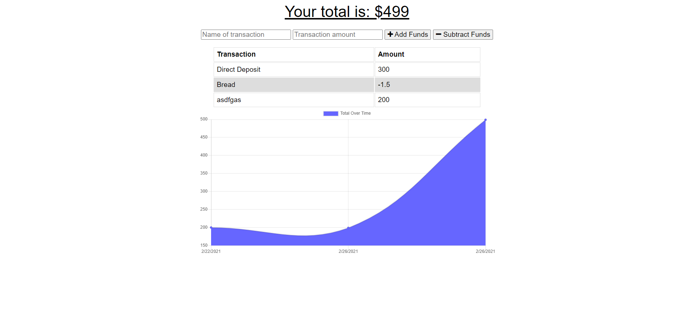

# financePWA

## Usage:  This app is a realtime transaction tracker that has offline capabilities.  When using the app online, users will be able to track their spending, as well as, log
incoming deposits into the tracker.  This app can be used as a good way to track expenses and also check the current balance while online.  Users are also able to add deposits and
withdrawls while offline, and have those transactions take place once the user reopens the app in an online enviroment.  

## Image of app: 